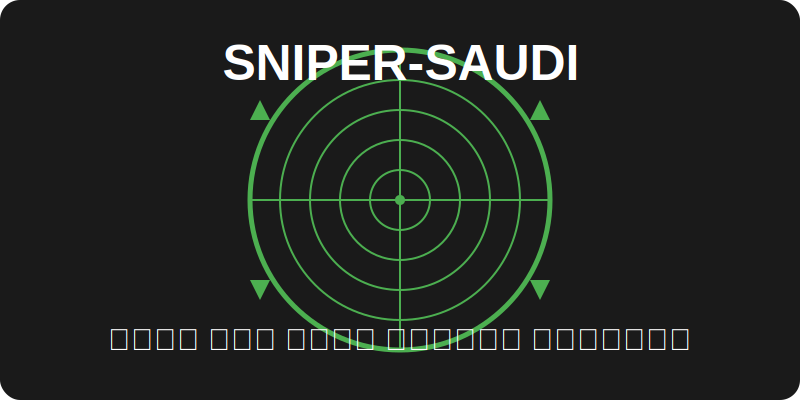

<link rel="stylesheet" href="style.css">

  

<h1 class="main-title">Sniper-Saudi</h1>

  
أداة فحص أمني متعددة الوظائف مصممة لاختبار الاختراق واكتشاف الثغرات الأمنية. توفر مجموعة شاملة من الأدوات والتقنيات لتقييم أمان الأنظمة والشبكات وتطبيقات الويب.

## الميزات

<ul class="feature-list">
  <li><strong>عادي</strong>: فحص أساسي للأهداف والمنافذ المفتوحة باستخدام فحوصات نشطة وسلبية للحصول على الأداء الأمثل.</li>
  <li><strong>التخفي</strong>: إحصاء الأهداف الفردية بسرعة باستخدام عمليات مسح غير تدخلية لتجنب حظر WAF/IPS.</li>
  <li><strong>FLYOVER</strong>: عمليات مسح سريعة متعددة الخيوط وعالية المستوى لأهداف متعددة.</li>
  <li><strong>AIRSTRIKE</strong>: يُحصي المنافذ/الخدمات المفتوحة بسرعة على عدة مضيفين، ويُجري بصمة أساسية.</li>
  <li><strong>NUKE</strong>: تدقيق كامل لمضيفين متعددين محددين في ملف نصي.</li>
  <li><strong>اكتشف</strong>: يُحلل جميع المضيفين على شبكة فرعية/CIDR ويبدأ فحصًا شاملًا لكل مضيف.</li>
  <li><strong>المنفذ</strong>: يفحص منفذًا محددًا بحثًا عن الثغرات الأمنية.</li>
  <li><strong>FULLPORTONLY</strong>: فحص تفصيلي كامل للمنافذ مع حفظ النتائج في XML.</li>
  <li><strong>MASSPORTSCAN</strong>: يقوم بتشغيل فحص "fullportonly" على أهداف متعددة.</li>
  <li><strong>ويب</strong>: عمليات مسح تلقائية كاملة لتطبيقات الويب (المنفذ 80/tcp و443/tcp).</li>
  <li><strong>MASSWEB</strong>: يقوم بتشغيل عمليات مسح وضع "الويب" على أهداف متعددة.</li>
  <li><strong>WEBPORTHTTP</strong>: فحص تطبيق الويب HTTP الكامل ضد مضيف ومنفذ محددين.</li>
  <li><strong>WEBPORTHTTPS</strong>: فحص تطبيق الويب HTTPS الكامل ضد مضيف ومنفذ محددين.</li>
  <li><strong>WEBSCAN</strong>: فحص كامل لتطبيقات الويب HTTP و HTTPS عبر Burpsuite و Arachni.</li>
  <li><strong>MASSWEBSCAN</strong>: يقوم بتشغيل عمليات مسح وضع "webscan" لأهداف متعددة.</li>
  <li><strong>VULNSCAN</strong>: فحص الثغرات الأمنية في OpenVAS.</li>
  <li><strong>MASSVULNSCAN</strong>: يقوم بتشغيل عمليات مسح وضع "vulnscan" على أهداف متعددة.</li>
</ul>

## طريقة الاستخدام

<pre>
python sniper.py -t &lt;TARGET&gt; -m &lt;MODE&gt; [OPTIONS]
</pre>

### الأوضاع المتاحة:

<ul class="mode-list">
  <li><strong>normal</strong>: فحص أساسي للأهداف والمنافذ المفتوحة</li>
  <li><strong>stealth</strong>: فحص غير تدخلي للأهداف الفردية</li>
  <li><strong>flyover</strong>: فحص سريع متعدد الخيوط لأهداف متعددة</li>
  <li><strong>airstrike</strong>: فحص سريع للمنافذ/الخدمات المفتوحة</li>
  <li><strong>nuke</strong>: تدقيق كامل لمضيفين متعددين</li>
  <li><strong>discover</strong>: تحليل المضيفين على شبكة فرعية/CIDR</li>
  <li><strong>port</strong>: فحص منفذ محدد</li>
  <li><strong>fullportonly</strong>: فحص تفصيلي كامل للمنافذ</li>
  <li><strong>massportscan</strong>: فحص "fullportonly" لأهداف متعددة</li>
  <li><strong>web</strong>: فحص تطبيقات الويب</li>
  <li><strong>massweb</strong>: فحص وضع "الويب" لأهداف متعددة</li>
  <li><strong>webporthttp</strong>: فحص تطبيق الويب HTTP</li>
  <li><strong>webporthttps</strong>: فحص تطبيق الويب HTTPS</li>
  <li><strong>webscan</strong>: فحص كامل لتطبيقات الويب HTTP و HTTPS</li>
  <li><strong>masswebscan</strong>: فحص وضع "webscan" لأهداف متعددة</li>
  <li><strong>vulnscan</strong>: فحص الثغرات الأمنية</li>
  <li><strong>massvulnscan</strong>: فحص وضع "vulnscan" لأهداف متعددة</li>
</ul>

## المتطلبات

  <ul class="requirements-list">
    <li><i class="req-icon python"></i><strong>Python 3.6+</strong></li>
    <li><i class="req-icon nmap"></i><strong>Nmap</strong></li>
    <li><i class="req-icon metasploit"></i><strong>Metasploit Framework</strong> (اختياري)</li>
    <li><i class="req-icon openvas"></i><strong>OpenVAS</strong> (اختياري للفحص الشامل للثغرات)</li>
    <li><i class="req-icon nikto"></i><strong>Nikto</strong></li>
    <li><i class="req-icon dirsearch"></i><strong>Dirsearch</strong></li>
    <li><i class="req-icon gobuster"></i><strong>Gobuster</strong></li>
    <li><i class="req-icon masscan"></i><strong>Masscan</strong></li>
    <li><i class="req-icon shodan"></i><strong>Shodan API</strong> (اختياري)</li>
    <li><i class="req-icon burpsuite"></i><strong>Burpsuite</strong> (اختياري لفحص تطبيقات الويب)</li>
    <li><i class="req-icon arachni"></i><strong>Arachni</strong> (اختياري لفحص تطبيقات الويب)</li>
  </ul>

## التثبيت

  

    <h3><i class="os-icon windows"></i> ويندوز</h3>
    <ol class="install-steps">
      <li>قم بتثبيت Python 3.6+ من <a href="https://www.python.org/downloads/" class="download-link">الموقع الرسمي</a>.</li>
      <li>قم بتثبيت Nmap من <a href="https://nmap.org/download.html" class="download-link">الموقع الرسمي</a>.</li>
      <li>قم بتشغيل <code>install.bat</code> لتثبيت جميع التبعيات المطلوبة.</li>
    </ol>
  

  

    <h3><i class="os-icon linux"></i> لينكس</h3>
    

      <pre>
git clone https://github.com/yourusername/sniper-saudi.git
cd sniper-saudi
chmod +x install.sh
./install.sh</pre>
    

  

## إخلاء المسؤولية

  
⚠️

  

    
هذه الأداة مخصصة للاستخدام في اختبار الاختراق الأخلاقي وتقييم الأمان فقط. المؤلف غير مسؤول عن أي إساءة استخدام أو ضرر ناتج عن هذه الأداة. استخدم هذه الأداة على مسؤوليتك الخاصة.

  

## المطور

  

    

    

      <h3>فريق Sniper-Saudi</h3>
      
تم تطوير هذه الأداة بواسطة <a href="https://github.com/yourusername" class="developer-link">فريق Sniper-Saudi</a>.

      

        <a href="https://github.com/yourusername" class="social-link github"><i class="social-icon github"></i></a>
        <a href="https://twitter.com/yourusername" class="social-link twitter"><i class="social-icon twitter"></i></a>
      

    

  

